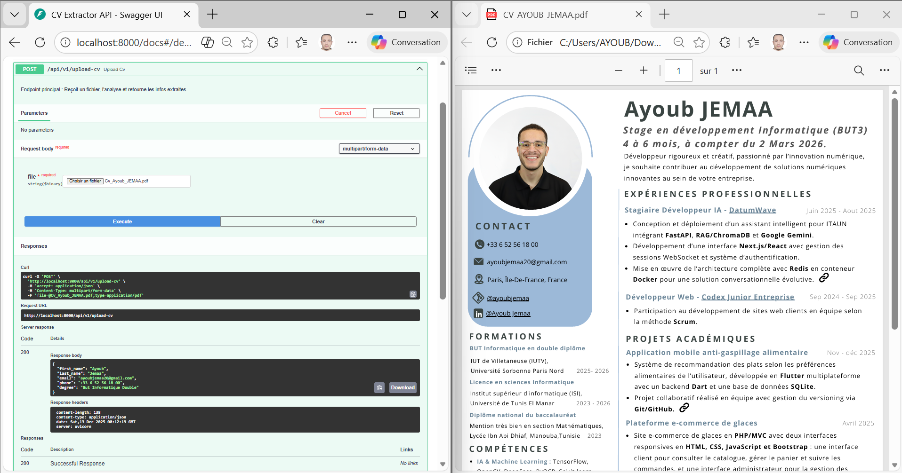
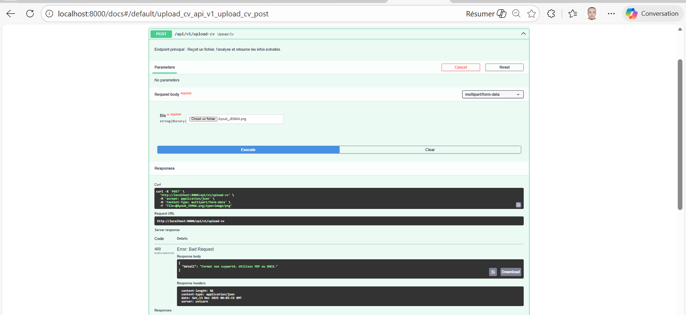
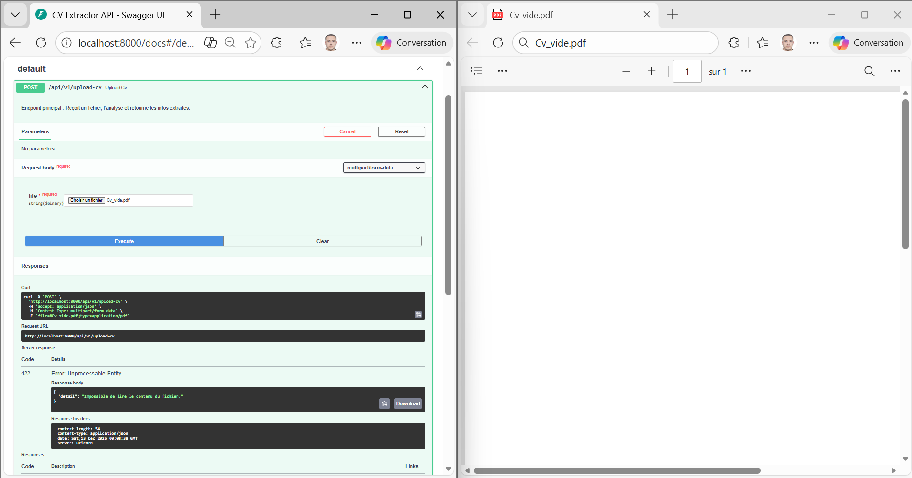
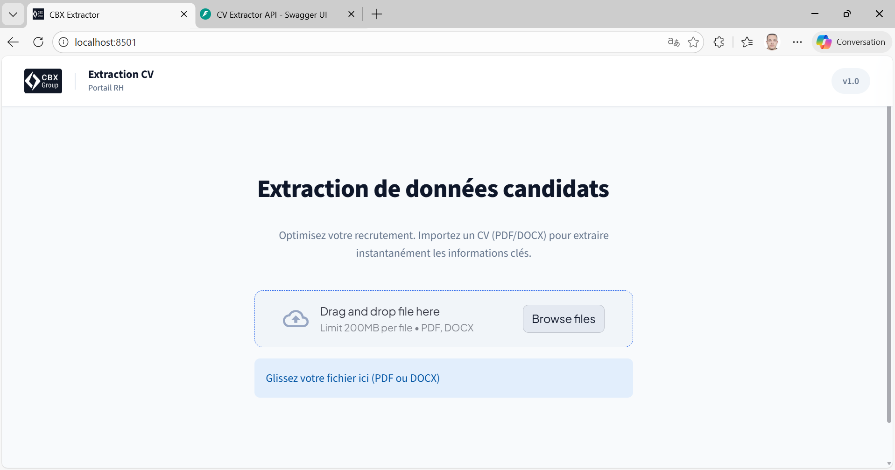
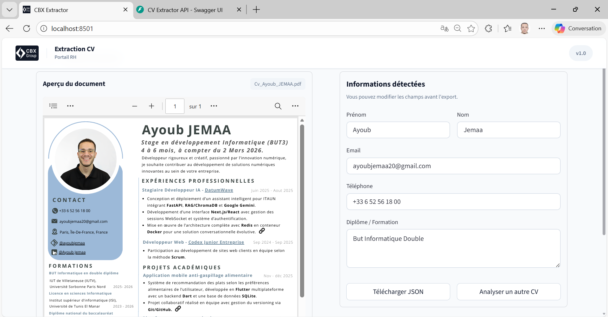
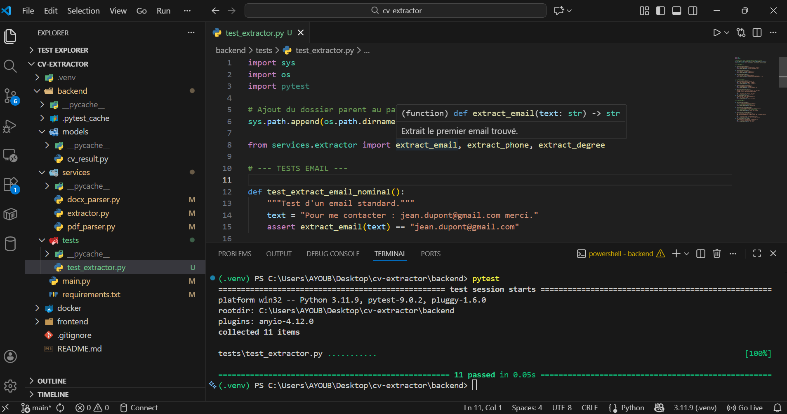

# CV Extractor

## Installation & Configuration

### 1. Cloner le projet
Récupérez le code source depuis le dépôt GitHub :

```bash
git clone https://github.com/ayoubjemaa/cv-extractor.git
cd cv-extractor
```

### 2. Création de l'environnement virtuel

Il est recommandé d'isoler les dépendances du projet.

#### Sous Windows

```powershell
python -m venv .venv
# Activation
.\.venv\Scripts\activate
```

#### Sous Linux / macOS

```bash
python3 -m venv .venv
# Activation
source .venv/bin/activate
```

### 3. Installation des dépendances

Une fois l'environnement activé, installez les paquets nécessaires pour le backend et le frontend.

```bash
# Mettre à jour pip (recommandé)
python -m pip install --upgrade pip

# Installer les dépendances du backend
pip install -r backend/requirements.txt

# Installer les dépendances du frontend
pip install -r frontend/requirements.txt

# Vérifier l'installation
pip list
```

**Dépendances principales :**
- **Backend** : FastAPI, python-multipart, pydantic, pytest, etc.
- **Frontend** : Streamlit pour l'interface utilisateur
- **Parsers** : python-pptx (pour les fichiers DOCX), PyPDF2 ou pdfplumber (pour les PDF)

## Lancement local (sans Docker)

Pour tester l'application localement, lancez le Backend et le Frontend dans deux terminaux séparés.

### Backend (FastAPI)

Depuis la racine du projet :

```bash
uvicorn backend.main:app --reload --host 0.0.0.0 --port 8000
```

L'API sera accessible sur : **http://localhost:8000**  
Documentation interactive (Swagger) : **http://localhost:8000/docs**

### Frontend (Streamlit)

Depuis la racine du projet :

```bash
streamlit run frontend/app.py --server.port=8501
```

L'interface sera accessible sur : **http://localhost:8501**

> **Note :** Lancez les deux commandes dans deux terminaux différents et simultanément.

## Lancement avec Docker (recommandé)

Docker permet de lancer tout le projet d'un seul coup sans gérer les dépendances Python manuellement.

### Installation de Docker

#### Windows (Docker Desktop + WSL 2)

1. **Téléchargez** [Docker Desktop pour Windows](https://www.docker.com/products/docker-desktop)
2. **Installez** en cochant l'option **« Use WSL 2 based engine »**
3. **Lancez** l'application Docker Desktop
4. **Vérifiez** l'installation :

```powershell
docker --version
docker-compose --version
```

#### Linux (Ubuntu / Debian)

1. **Installez** Docker et Compose :

```bash
sudo apt-get update
sudo apt-get install docker.io docker-compose-plugin
```

2. **Démarrez** le service :

```bash
sudo systemctl start docker
sudo systemctl enable docker
```

3. **Configurez** les permissions (optionnel, pour éviter `sudo`) :

```bash
sudo usermod -aG docker $USER
# Redémarrez votre session pour appliquer les changements
```

### Démarrer l'application

À la racine du projet, exécutez :

```bash
docker-compose -f docker/docker-compose.yml up --build
```

L'application Streamlit sera accessible sur : **http://localhost:8501**

> **Conseil :** Utilisez `docker-compose -f docker/docker-compose.yml up` (sans `--build`) aux lancements suivants pour plus de rapidité.

## API REST — Utilisation complète

### Vue d'ensemble

L'API analyse des fichiers CV au format **PDF** ou **DOCX** et extrait automatiquement les informations personnelles clés :

- **Prénom** et **nom**
- **Email** (détecte les formats courants : nom@domaine.com)
- **Téléphone** (formats français et internationaux)
- **Diplôme** (détecte les mentions comme "Master", "Licence", "Bac+3", etc.)

### Endpoint principal

```
POST /api/v1/upload-cv
```

**Content-Type** : `multipart/form-data`  
**Paramètre** : `file` (fichier PDF ou DOCX, max 10 MB recommandé)

### Réponse standard

```json
{
  "first_name": "string",
  "last_name": "string",
  "email": "string ou null",
  "phone": "string ou null",
  "degree": "string ou null"
}
```

### Exemples d'utilisation

#### 1) Succès — Code 200 (OK)

**Description :** CV valide analysé avec succès.

**Requête :**

```bash
curl -X POST "http://localhost:8000/api/v1/upload-cv" \
  -H "accept: application/json" \
  -H "Content-Type: multipart/form-data" \
  -F "file=@Cv_Ayoub_JEMAA.pdf;type=application/pdf"
```

**Réponse :**

```json
{
  "first_name": "Ayoub",
  "last_name": "Jemaa",
  "email": "ayoubjemaa20@gmail.com",
  "phone": "+33 6 52 56 18 00",
  "degree": "But Informatique Double"
}
```

<div align="center">
    <p style="color:green; font-weight:bold;"> Résultat — Code 200 (Succès)</p>
    
</div>

#### 2) Erreur — Code 400 (Format non supporté)

**Description :** Le fichier n'est pas en PDF ou DOCX (ex. image, TXT, Word 97-2003).

**Requête :**

```bash
curl -X POST "http://localhost:8000/api/v1/upload-cv" \
  -H "accept: application/json" \
  -H "Content-Type: multipart/form-data" \
  -F "file=@Ayoub_JEMAA.png;type=image/png"

```

**Réponse :**

```json
{
  "detail": "Format non supporté. Utilisez PDF ou DOCX."
}
```

<div align="center">
    <p style="color:red; font-weight:bold;"> Résultat — Code 400 (Format invalide)</p>
    
</div>

#### 3) Erreur — Code 422 (Entité non traitable)

**Description :** Le CV est vide, corrompu ou contient uniquement une image scannée (OCR non supporté).

**Requête :**

```bash
curl -X POST "http://localhost:8000/api/v1/upload-cv" \
  -H "accept: application/json" \
  -H "Content-Type: multipart/form-data" \
  -F "file=@Cv_vide.pdf;type=application/pdf"
```

**Réponse :**

```json
{
  "detail": "Fichier illisible ou image scannée non supportée."
}
```

<div align="center">
    <p style="color:orange; font-weight:bold;">Résultat — Code 422 (Impossible à traiter)</p>
    
</div>

#### 4) Erreur — Code 500 (Erreur serveur)

**Description :** Erreur interne du serveur (bug, exception, ressources insuffisantes).

**Réponse :**

```json
{
  "detail": "Erreur interne du serveur."
}
```

### Cas d'usage supplémentaires

| Cas | Code HTTP | Détails |
|-----|-----------|---------|
| Fichier valide analysé | 200 | Extraction réussie |
| Format invalide | 400 | Utiliser PDF ou DOCX |
| Fichier vide ou scanné | 422 | Téléverser un PDF texte valide |
| Erreur serveur | 500 | Contacter le support |
| Fichier > 10 MB | 413 | Réduire la taille du fichier |

## Guide d'utilisation

### Étapes rapides

1. **Préparez** un CV en format **PDF** ou **DOCX** avec du texte extractible
2. **Envoyez-le** à l'endpoint `/api/v1/upload-cv` :
   - Via cURL (voir exemples ci-dessus)
   - Via Postman (importer comme `multipart/form-data`)
   - Via l'interface Streamlit (recommandé pour les utilisateurs)
3. **Récupérez** le JSON avec les champs extraits
4. **Intégrez** les données dans votre système

## Interface utilisateur (Streamlit)

L'application Streamlit offre une interface simple et intuitive pour traiter les CV sans utiliser l'API directement.

### 1) Page de chargement

**Description :** Permet de sélectionner et téléverser un CV en PDF ou DOCX.

<div align="center">
    
    <p><i>Écran de chargement de fichier</i></p>
</div>

### 2) Page de résultats

**Description :** Affiche les informations extraites du CV analysé etpermet de télécharger le fichier json des données extraites.

<div align="center">
    
    <p><i>Écran des résultats d'extraction</i></p>
</div>

---

## Tests unitaires

### Vue d'ensemble

Le projet inclut une suite de tests unitaires pour valider le bon fonctionnement des fonctions d'extraction.
Un test unitaire permet de vérifier qu'une petite composante du code (méthode ou fonction) retourne le résultat attendu pour un cas donné.

**Outils utilisés :**
- **pytest** : framework de test
- **Coverage** : rapports de couverture de code

### Fonction testées

| Fonction | Description |
|----------|-------------|
| `extract_email()` | Détecte les adresses email valides |
| `extract_phone()` | Détecte les numéros de téléphone (formats français/internationaux) |
| `extract_name()` | Extrait prénom et nom |
| `extract_degree()` | Identifie les diplômes mentionnés |
| `clean_text()` | Nettoie et normalise le texte |

### Lancer les tests

```bash
# Exécuter tous les tests
pytest backend/tests/

# Avec rapport de couverture
pytest --cov=backend backend/tests/

# Rapport en HTML
pytest --cov=backend --cov-report=html backend/tests/
```

### Résultats

<div align="center">
    
    <p><i>Résultats des tests unitaires (pytest)</i></p>
</div>

---

## Structure du projet

```
cv-extractor/
├── backend/
│   ├── main.py                 # Serveur FastAPI principal
│   ├── requirements.txt         # Dépendances Python
│   ├── models/
│   │   └── cv_result.py        # Schéma Pydantic de réponse
│   ├── services/
│   │   ├── pdf_parser.py       # Extraction texte PDF
│   │   ├── docx_parser.py      # Extraction texte DOCX
│   │   └── extractor.py        # Fonctions d'extraction (email, phone, etc.)
│   └── tests/
│       └── test_extractor.py   # Suite de tests unitaires
├── frontend/
│   ├── app.py                  # Application Streamlit
│   └── requirements.txt         # Dépendances frontend
├── docker/
│   ├── Dockerfile.backend      # Image Docker backend
│   ├── Dockerfile.frontend     # Image Docker frontend
│   └── docker-compose.yml      # Orchestration des services
├── img/                        # Dossier pour les images (à créer)
└── README.md                   # Documentation (ce fichier)
```

--- 

## Licence

Ce projet est fourni à titre d'exemple. Consultez le fichier `LICENSE` pour plus de détails.

**Dernière mise à jour :** Décembre 2025  
**Version :** 1.0.0  
**Auteur :** Ayoub Jemaa